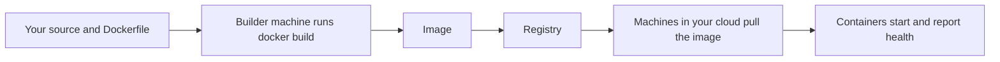

Beaver builds and deploys your application from a **Dockerfile you provide**. There's no
per-framework special case, because Docker itself is language-agnostic — the same build path
handles a Node API, a Go binary, and a Rails app identically.

## Why Dockerfile-first

Auto-detecting frameworks sounds convenient until it guesses wrong on your setup. Requiring
a Dockerfile means what builds on your laptop builds identically on Beaver's infrastructure —
no surprise behavior from a detector trying to be clever. You bring the Dockerfile once;
every connected machine builds from it the same way.

## What you can see and control

Build context and paths follow standard Docker conventions — the directory you deploy from
is the build context, and your Dockerfile's `COPY`/`ADD` instructions resolve relative to
it. Image naming and whether an image is private work the same as any other Docker registry.
Which connected machine actually runs the build follows your machine roles — see [Choosing
my setup](/start/choose-your-infrastructure).

## Diagnosing a failed build

There's no framework-specific fallback to lean on: if `docker build` fails on your own
machine, it will fail on Beaver's builder too. Start there — reproduce the build locally
before assuming the problem is Beaver-specific.

## Where to go next

<CardGroup cols={2}>
  <Card title="Dockerfile requirements" href="/deploy/dockerfile-requirements">
    What your Dockerfile needs to define.
  </Card>
  <Card title="Configuration" href="/deploy/configuration">
    Settings layered on top of the build.
  </Card>
  <Card title="Bring your own app" href="/deploy/bring-your-own-app">
    Any app with a Dockerfile and a port.
  </Card>
  <Card title="Preflight and planning" href="/deploy/preflight-and-planning">
    Checks you can run before committing to a build.
  </Card>
</CardGroup>
