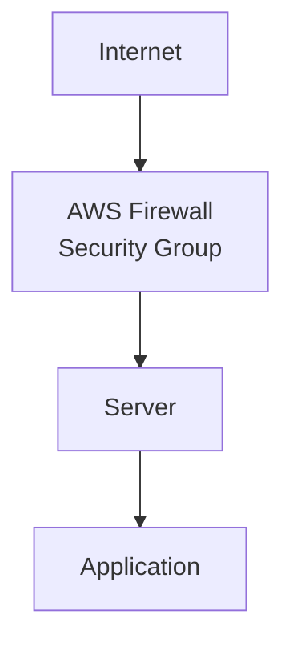

# AWS

Beaver deploys to infrastructure you own — including an EC2 instance in your own AWS account. This guide covers what to set up on the AWS side before you install the CLI and run `beaver connect`.

<Card title="Install Beaver CLI on Linux" icon="download" href="/installation">
  Once your instance is ready, this is the next step — install, log in, and connect.
</Card>

<Card title="Preparing a Google Cloud VM" icon="google" href="/infrastructure-setup/google-cloud">
  Setting up on Google Cloud instead? See the equivalent guide.
</Card>

<Card title="Preparing an Azure Virtual Machine" icon="microsoft" href="/infrastructure-setup/azure">
  Setting up on Azure instead? See the equivalent guide.
</Card>

<Card title="Custom VPS Providers" icon="server" href="/infrastructure-setup/custom-vps-providers">
  Using Contabo, Hetzner, Hostinger, or another provider instead? See the general guide.
</Card>

---

## Creating an EC2 instance

<Columns>
  <Column>
    <Check>A supported Linux distribution — Ubuntu, Debian, or Rocky Linux</Check>
    <Check>An instance type sized for your workload (a small general-purpose type like `t3.small` is enough to start)</Check>
    <Check>At least 20 GB of storage</Check>
  </Column>
  <Column>
    <Check>A key pair for SSH access</Check>
    <Check>A public IP address (or an Elastic IP, if you want it to stay the same)</Check>
  </Column>
</Columns>

<Tip>
  If this instance will build your application as well as run it, give it more CPU and memory than you'd use for running alone — see [Machine Roles](/machine-roles) for sizing guidance per role.
</Tip>

---

## Security Group setup

Your instance's Security Group is AWS's firewall — it controls which network traffic is allowed to reach it. Open these ports:

| Port | Purpose |
| --- | --- |
| **22** | SSH access — needed to connect to and manage the instance |
| **80** | HTTP traffic — needed if your application serves plain HTTP |
| **443** | HTTPS traffic — needed if your application serves HTTPS |

<Warning>
  If your application listens on a different port than 80 or 443, open that port too. The port your Security Group allows must match the port your application actually listens on — see [Deployment Configuration](/deploying/deployment-configuration).
</Warning>

<Tip>
  Restrict port 22 to your own IP address (or a known range) instead of leaving it open to everyone — you can always widen it later.
</Tip>

---

## Why ports are required

Traffic to your application has to pass through a few layers before it reaches your app, and each layer has to be configured to let it through:

If any layer blocks a port, traffic stops there — a closed port in your Security Group never reaches your server at all, and a port your application isn't listening on won't respond even if the Security Group allows it.

See [Firewall Requirements](/infrastructure-setup/firewall-requirements) for a deeper look at why this is required and how to handle custom ports.

---

## Troubleshooting

<AccordionGroup>
  <Accordion title="Cannot connect to the instance">
    - Confirm the instance is running and has a public IP address
    - Confirm port 22 is open in the Security Group, and your IP is allowed if you've restricted it
    - Confirm you're using the correct key pair and username for your Linux distribution
  </Accordion>

  <Accordion title="Application is unavailable">
    - Confirm your application is actually running and listening on the port you expect
    - Confirm that port matches what's set in [Deployment Configuration](/deploying/deployment-configuration)
    - Confirm the Security Group allows traffic on that port
  </Accordion>

  <Accordion title="Firewall is blocking traffic">
    - Double-check the Security Group's inbound rules include the port you need, from the source (`0.0.0.0/0` for public access, or a specific range)
    - If your Linux distribution runs its own firewall (like `ufw` or `firewalld`) in addition to the Security Group, confirm it isn't also blocking the port
    - Remember both layers — AWS's Security Group and any OS-level firewall — need to allow the port
  </Accordion>
</AccordionGroup>

---

<CardGroup cols={2}>
  <Card title="Install Beaver CLI on Linux" icon="download" href="/installation">
    Install, log in, and connect this instance.
  </Card>
  <Card title="Machine Roles" icon="layer-group" href="/machine-roles">
    Decide whether this instance should build, run, or do both.
  </Card>
</CardGroup>
