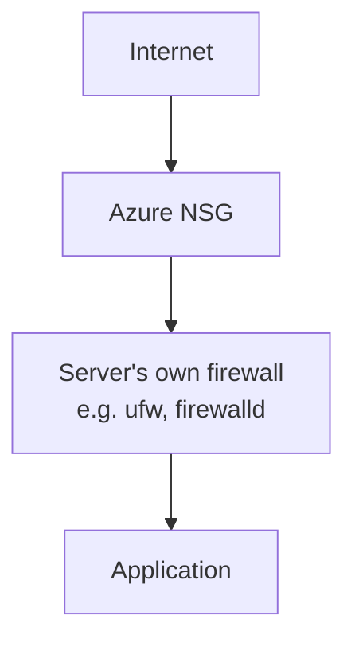

# Azure

Beaver deploys to infrastructure you own — including a Virtual Machine in your own Azure subscription. This guide covers creating the VM, opening the right network rules, installing Beaver, and connecting it.

<CardGroup cols={2}>
  <Card title="Preparing an AWS EC2 Instance" icon="aws" href="/infrastructure-setup/aws">
    Setting up on AWS instead? See the equivalent guide.
  </Card>
  <Card title="Preparing a Google Cloud VM" icon="google" href="/infrastructure-setup/google-cloud">
    Setting up on Google Cloud instead? See the equivalent guide.
  </Card>
  <Card title="Custom VPS Providers" icon="server" href="/infrastructure-setup/custom-vps-providers">
    Using Contabo, Hetzner, Hostinger, or another provider instead? See the general guide.
  </Card>
</CardGroup>

---

## Creating a VM

<Tabs>
  <Tab title="Portal">
    <Steps>
      <Step title="Open Virtual Machines">
        In the [Azure Portal](https://portal.azure.com), go to **Virtual machines → Create → Azure virtual machine**.
      </Step>
      <Step title="Choose an image">
        Under **Image**, select a supported Linux distribution — Ubuntu, Debian, or Rocky Linux.
      </Step>
      <Step title="Choose a size">
        A small general-purpose size (like `Standard_B2s`) is enough to start. Size up if this machine will also build your application — see [Machine Roles](/machine-roles).
      </Step>
      <Step title="Set up SSH access">
        Choose SSH public key authentication and provide (or generate) a key pair.
      </Step>
      <Step title="Configure inbound ports">
        On the **Networking** tab, you'll be asked which inbound ports to allow — you can select SSH (22), HTTP (80), and HTTPS (443) here, or configure the Network Security Group yourself afterward (see the next section).
      </Step>
      <Step title="Create the VM">
        Click **Review + create**, then **Create**. Once it's running, note its public IP address.
      </Step>
    </Steps>
  </Tab>
  <Tab title="Azure CLI (optional)">
    ```bash
    az vm create \
      --resource-group my-resource-group \
      --name my-beaver-vm \
      --image Ubuntu2204 \
      --size Standard_B2s \
      --admin-username azureuser \
      --generate-ssh-keys
    ```
  </Tab>
</Tabs>

<Check>At least 20 GB of disk and a way to reach the VM over SSH is all you need before moving on.</Check>

---

## Network Security Group rules and required ports

Azure filters traffic to your VM with a **Network Security Group (NSG)** — a set of allow/deny rules attached to your VM or its subnet. Open these ports in your NSG:

| Port | Purpose |
| --- | --- |
| **22** | SSH access — needed to connect to and manage the VM |
| **80** | HTTP traffic — needed if your application serves plain HTTP |
| **443** | HTTPS traffic — needed if your application serves HTTPS |

<Warning>
  If your application listens on a different port than 80 or 443, open that port too. The port your NSG allows must match the port your application actually listens on — see [Deployment Configuration](/deploying/deployment-configuration).
</Warning>

<Tabs>
  <Tab title="Portal">
    Go to your VM's **Networking** page, select the Network Security Group, and add inbound security rules for ports `22`, `80`, and `443` (plus any custom port your app needs) from the source you want (`Any` for public access, or your own IP for SSH).
  </Tab>
  <Tab title="Azure CLI (optional)">
    ```bash
    az vm open-port \
      --resource-group my-resource-group \
      --name my-beaver-vm \
      --port 80,443 \
      --priority 900
    ```

    <Tip>
      Restrict SSH to your own IP with a separate, narrower rule instead of leaving port 22 open to everyone:

      ```bash
      az network nsg rule create \
        --resource-group my-resource-group \
        --nsg-name my-beaver-vmNSG \
        --name allow-ssh-restricted \
        --priority 800 \
        --destination-port-ranges 22 \
        --source-address-prefixes YOUR_IP/32 \
        --access Allow --protocol Tcp
      ```
    </Tip>
  </Tab>
</Tabs>

### NSG vs. the server's own firewall

There are two separate firewalls between the internet and your application, and both have to allow a port before traffic gets through:



- **The Network Security Group** is Azure's firewall, sitting in front of your VM at the network level. It's configured from the Portal or Azure CLI, not from inside the VM.
- **The server's own firewall** (if your Linux distribution runs one, like `ufw` or `firewalld`) runs inside the VM itself and filters traffic after it's already passed the NSG.

A port open in one but not the other still won't work — the NSG has to allow the port *and* the server's own firewall (if enabled) has to allow it too.

See [Firewall Requirements](/infrastructure-setup/firewall-requirements) for a deeper look at why this is required and how to handle custom ports.

---

## Installing Beaver

SSH into your new VM, then follow [Install Beaver CLI on Linux](/installation) to install the CLI, verify it, and log in:

```bash
curl -fsSL https://cli.vectorihub.com/install.sh | sh
beaver version
```

---

## Connecting the machine

Start the interactive shell, log in, and connect:

```bash
beaver
```

```txt
beaver ▸ login
beaver ▸ connect
```

`connect` checks the machine over and asks which role you want it to fill.

<CardGroup cols={2}>
  <Card title="Choose Your Beaver Setup" icon="compass" href="/choose-your-setup">
    Not sure whether to pick Builder, Host, or Builder + Host? Get a 2-minute answer.
  </Card>
  <Card title="beaver connect" icon="plug" href="/connect">
    Read the full `connect` walkthrough — prerequisites, verification, and troubleshooting.
  </Card>
</CardGroup>

---

## Troubleshooting

<AccordionGroup>
  <Accordion title="Cannot connect to the VM">
    - Confirm the VM is running and has a public IP address
    - Confirm the NSG allows inbound traffic on port 22, and your IP is allowed if you've restricted it
    - Confirm you're using the correct SSH key and admin username for the VM
  </Accordion>

  <Accordion title="Application is unavailable">
    - Confirm your application is actually running and listening on the port you expect
    - Confirm that port matches what's set in [Deployment Configuration](/deploying/deployment-configuration)
    - Confirm the NSG allows traffic on that port
  </Accordion>

  <Accordion title="Firewall is blocking traffic">
    - Double-check your NSG's inbound rules include the port you need, from the source you expect
    - If the VM also runs its own firewall (like `ufw` or `firewalld`), confirm it isn't also blocking the port — see [NSG vs. the server's own firewall](#nsg-vs-the-servers-own-firewall) above
    - Remember both layers need to allow the port — opening one without the other still blocks traffic
  </Accordion>
</AccordionGroup>

---

<CardGroup cols={2}>
  <Card title="Install Beaver CLI on Linux" icon="download" href="/installation">
    Install, log in, and connect this instance.
  </Card>
  <Card title="Machine Roles" icon="layer-group" href="/machine-roles">
    Decide whether this instance should build, run, or do both.
  </Card>
</CardGroup>
