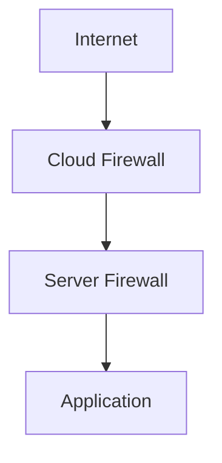

# Firewall Requirements

Every server you connect to Beaver blocks network traffic by default. This page explains why, and what you need to configure so your application is actually reachable.

## Why servers block traffic

A server that accepts every connection on every port is an easy target — so both cloud providers and Linux distributions ship with a "deny by default" posture: nothing gets in unless something explicitly allows it.

That's good for security, but it means **you** have to open the specific ports your application needs. Nothing is reachable automatically.

---

## Two layers, not one

Traffic to your application almost always has to pass through two separate firewalls, and both have to allow it:



- **Cloud firewall** — configured through your provider, outside the server itself. It decides what's allowed to reach the server at all.
- **Server firewall** — runs on the server itself, if enabled. It decides what's allowed to reach the applications running on it.

<Warning>
  A port open in only one layer still doesn't work. Traffic has to pass **both** before it reaches your application.
</Warning>

### Cloud firewall

Every major provider has its own name for this, but the idea is the same — rules that live outside your server and control what can reach it:

| Provider | What it's called |
| --- | --- |
| AWS | Security Groups |
| Google Cloud | Firewall Rules |
| Azure | Network Security Groups (NSG) |

See the setup guide for your provider — [AWS](/infrastructure-setup/aws), [Google Cloud](/infrastructure-setup/google-cloud), [Azure](/infrastructure-setup/azure), or [Custom VPS Providers](/infrastructure-setup/custom-vps-providers) — for exactly where to configure this.

### Server firewall

Some Linux distributions also run a firewall on the server itself — most commonly **UFW** on Ubuntu. If it's enabled, it independently decides what's allowed in, on top of whatever the cloud firewall allows.

```bash
# Check whether UFW is active
sudo ufw status
```

If UFW is inactive, only the cloud firewall applies. If it's active, both layers need to agree.

---

## Application ports

At minimum, most setups need:

| Port | Purpose |
| --- | --- |
| **22/TCP** | SSH — managing your server remotely |
| **80/TCP** | HTTP traffic |
| **443/TCP** | HTTPS traffic |

If your application listens on a different port, that port needs to be allowed too — at both layers.

---

## Worked example: an app on port 3000

Say your application listens on port `3000` instead of 80 or 443. Here's what needs to happen at each layer before it's reachable:

<Steps>
  <Step title="Allow port 3000 in your cloud firewall">
    Add a rule allowing inbound traffic on port `3000` — a Security Group rule on AWS, a Firewall Rule on Google Cloud, or an NSG rule on Azure.
  </Step>
  <Step title="Allow port 3000 in your server firewall, if enabled">
    ```bash
    sudo ufw allow 3000/tcp
    ```
  </Step>
  <Step title="Confirm your application is listening on 3000">
    The port has to match what your app actually binds to — see [Deployment Configuration](/deploying/deployment-configuration).
  </Step>
</Steps>

If you only complete step 1, the cloud firewall lets the traffic reach the server, but the server firewall drops it before it reaches your app. If you only complete step 2, there's nothing to allow through in the first place — the cloud firewall never lets the traffic reach the server at all. Both are required.

---

<CardGroup cols={2}>
  <Card title="Custom VPS Providers" icon="server" href="/infrastructure-setup/custom-vps-providers">
    General firewall setup across VPS providers.
  </Card>
  <Card title="Deployment Configuration" icon="sliders" href="/deploying/deployment-configuration">
    Set the port your application serves traffic on.
  </Card>
</CardGroup>
