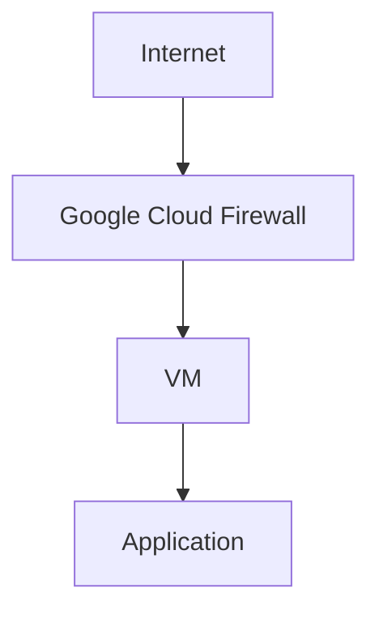

# Google Cloud

Beaver deploys to infrastructure you own — including a VM in your own Google Cloud project. This guide covers creating the VM, installing Beaver, opening the right firewall rules, and connecting it.

<Card title="Preparing an AWS EC2 Instance" icon="aws" href="/infrastructure-setup/aws">
  Setting up on AWS instead? See the equivalent guide.
</Card>

<Card title="Preparing an Azure Virtual Machine" icon="microsoft" href="/infrastructure-setup/azure">
  Setting up on Azure instead? See the equivalent guide.
</Card>

<Card title="Custom VPS Providers" icon="server" href="/infrastructure-setup/custom-vps-providers">
  Using Contabo, Hetzner, Hostinger, or another provider instead? See the general guide.
</Card>

---

## Creating a VM

<Tabs>
  <Tab title="Console">
    <Steps>
      <Step title="Open Compute Engine">
        In the [Google Cloud Console](https://console.cloud.google.com/compute/instances), go to **Compute Engine → VM instances → Create instance**.
      </Step>
      <Step title="Choose an image">
        Under **Boot disk**, select a supported Linux distribution — Ubuntu, Debian, or Rocky Linux.
      </Step>
      <Step title="Choose a machine type">
        A small general-purpose type (like `e2-small`) is enough to start. Size up if this machine will also build your application — see [Machine Roles](/machine-roles).
      </Step>
      <Step title="Allow HTTP/HTTPS traffic (optional here)">
        You can check the console's built-in **Allow HTTP traffic** / **Allow HTTPS traffic** boxes now, or configure firewall rules yourself in the next section — either works.
      </Step>
      <Step title="Create the instance">
        Click **Create**. Once it's running, note its external IP address.
      </Step>
    </Steps>
  </Tab>
  <Tab title="gcloud (optional)">
    ```bash
    gcloud compute instances create my-beaver-vm \
      --image-family=debian-12 \
      --image-project=debian-cloud \
      --machine-type=e2-small \
      --boot-disk-size=20GB
    ```
  </Tab>
</Tabs>

<Check>At least 20 GB of disk and a way to reach the instance over SSH (a Google Cloud key pair, or OS Login) is all you need before moving on.</Check>

---

## Installing Beaver

SSH into your new VM, then follow [Install Beaver CLI on Linux](/installation) to install the CLI, verify it, and log in:

```bash
curl -fsSL https://cli.vectorihub.com/install.sh | sh
beaver version
```

---

## Configuring firewall rules

Google Cloud firewall rules control which network traffic is allowed to reach your VM. Open these ports:

| Port | Purpose |
| --- | --- |
| **22** | SSH access — needed to connect to and manage the instance |
| **80** | HTTP traffic — needed if your application serves plain HTTP |
| **443** | HTTPS traffic — needed if your application serves HTTPS |

<Warning>
  If your application listens on a different port than 80 or 443, open that port too. The port your firewall rule allows must match the port your application actually listens on — see [Deployment Configuration](/deploying/deployment-configuration).
</Warning>

<Tabs>
  <Tab title="Console">
    Go to **VPC network → Firewall → Create firewall rule**, and add a rule allowing ingress on TCP ports `22,80,443` (plus any custom port your app needs) from the source range you want (`0.0.0.0/0` for public access, or your own IP for SSH).
  </Tab>
  <Tab title="gcloud (optional)">
    ```bash
    gcloud compute firewall-rules create allow-beaver-app \
      --allow=tcp:22,tcp:80,tcp:443 \
      --direction=INGRESS \
      --source-ranges=0.0.0.0/0
    ```

    <Tip>
      Restrict SSH to your own IP with a separate, narrower rule instead of leaving port 22 open to everyone:

      ```bash
      gcloud compute firewall-rules create allow-ssh-restricted \
        --allow=tcp:22 \
        --source-ranges=YOUR_IP/32
      ```
    </Tip>
  </Tab>
</Tabs>

### Why ports are required

Traffic to your application has to pass through a few layers, and each one has to be configured to let it through:



If any layer blocks a port, traffic stops there — a closed firewall rule never reaches your VM at all, and a port your application isn't listening on won't respond even if the firewall allows it.

See [Firewall Requirements](/infrastructure-setup/firewall-requirements) for a deeper look at why this is required and how to handle custom ports.

---

## Connecting the machine

Start the interactive shell, log in, and connect:

```bash
beaver
```

```txt
beaver ▸ login
beaver ▸ connect
```

`connect` checks the machine over and asks which role you want it to fill.

<Card title="Choose Your Beaver Setup" icon="compass" href="/choose-your-setup">
  Not sure whether to pick Builder, Host, or Builder + Host? Get a 2-minute answer.
</Card>

<Card title="beaver connect" icon="plug" href="/connect">
  Read the full `connect` walkthrough — prerequisites, verification, and troubleshooting.
</Card>

---

## Troubleshooting

<AccordionGroup>
  <Accordion title="Cannot connect to the VM">
    - Confirm the instance is running and has an external IP address
    - Confirm a firewall rule allows ingress on port 22, and your IP is allowed if you've restricted it
    - Confirm you're using the correct SSH key or OS Login credentials for your account
  </Accordion>

  <Accordion title="Application is unavailable">
    - Confirm your application is actually running and listening on the port you expect
    - Confirm that port matches what's set in [Deployment Configuration](/deploying/deployment-configuration)
    - Confirm a firewall rule allows traffic on that port
  </Accordion>

  <Accordion title="Firewall is blocking traffic">
    - Double-check your firewall rules include the port you need, from the source range you expect
    - If your Linux distribution runs its own firewall (like `ufw` or `firewalld`) in addition to the Google Cloud firewall, confirm it isn't also blocking the port
    - Remember both layers — the Google Cloud firewall and any OS-level firewall — need to allow the port
  </Accordion>
</AccordionGroup>

---

<CardGroup cols={2}>
  <Card title="Install Beaver CLI on Linux" icon="download" href="/installation">
    Install, log in, and connect this instance.
  </Card>
  <Card title="Machine Roles" icon="layer-group" href="/machine-roles">
    Decide whether this instance should build, run, or do both.
  </Card>
</CardGroup>
