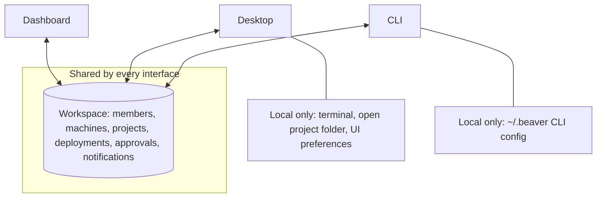

The three interfaces are views onto the same account and workspace. That gives you one simple rule: **anything that belongs to your workspace is shared; anything that belongs to a
device or a window is not.**

## Shared everywhere

These live with your workspace, so every interface shows the same thing (after a refresh):

| Shared | Examples |
| --- | --- |
| Workspace and membership | Who is in the workspace, their roles, plan and seats |
| Machines and clouds | Enrolled machines, their health, Beaver Clouds and their members |
| Projects and deployments | Projects, environments, deployments and their history, domains, variables |
| Services | Managed services, their status and attachments |
| Approvals | Pending production approvals, and who decided them |
| Notifications and activity | Your notification inbox, the workspace activity feed, incidents |
| Account | Your profile, sign-in methods and 2-step verification |

A project you deployed from the CLI is in the Dashboard's **Projects**; a machine you enrolled with `beaver connect` appears under **Nodes** in the Dashboard and under **Machines** in Desktop; an approval requested
from a CLI deploy can be approved in the Dashboard or in Desktop's **Approvals**.

## Stays on one device or window

These are deliberately local:

| Local | Where |
| --- | --- |
| Desktop's terminal, open project folder and workspace history | Beaver Desktop, on that computer |
| Desktop settings: General, Terminal, Appearance, Git guards, updates | Beaver Desktop, on that computer |
| Alie's local memory and context permissions | Beaver Desktop, on that computer |
| CLI configuration and your command history (`beaver history`) | The computer you ran the CLI on |
| Dashboard theme and which workspace the browser is using | That browser |
| **Which workspace is active** | Chosen separately in each interface — see [Switch workspaces](/teams/switch-workspaces) |

<Warning>
Switching workspace in one interface does **not** switch it in the others. If a command or screen shows unexpected data, check that both are acting in the same workspace —
`beaver workspace show` in the CLI, the workspace switcher in the Dashboard and Desktop.
</Warning>

## Start in the Dashboard, continue in the CLI

<Steps>
  <Step title="Create the project in the Dashboard">
    **Projects → Create project**, then deploy from a connected repository. The deployment appears under **Deployments**.
  </Step>
  <Step title="Check it from the CLI">
    On any computer where you are signed in, run `beaver whoami` and `beaver workspace show` to confirm the workspace, then `beaver containers` — the deployment is in the list.
  </Step>
  <Step title="Change it from the CLI">
    `beaver container <name> redeploy` rebuilds and replaces the release. Open the deployment's **Deployments** list in the Dashboard: the new release is there.
  </Step>
  <Step title="See the whole picture in Desktop">
    Open **Machines** or **Beaver Cloud** — the same containers appear on the machine that runs them.
  </Step>
</Steps>

## What this page does not cover

How the interfaces stay in step is not documented — only what you can observe. If two screens disagree for more than a moment, refresh; if they still disagree,
see [Troubleshooting](/operate/troubleshooting).

## Next steps

<CardGroup cols={2}>
  <Card title="Capability matrix" icon="table" href="/interfaces/capability-matrix">Which interface can do which task.</Card>
  <Card title="Switch workspaces" icon="arrow-left-right" href="/teams/switch-workspaces">Choose the active workspace everywhere.</Card>
</CardGroup>
