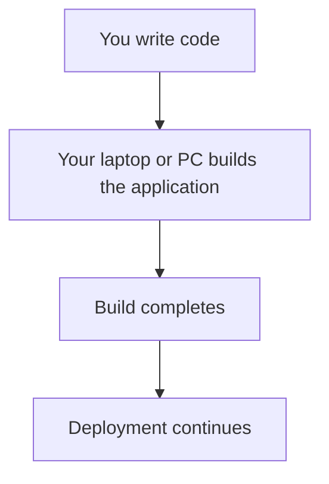

# Using Your Laptop or PC as a Builder

You don't always need to rent a server to build your application. Your own laptop, desktop, or workstation can act as a [Builder](/machine-roles#builder) — the machine responsible for turning your code into a Docker image.

For many developers, the computer they're already using is powerful enough to do this. Using it as a Builder lets you start using Beaver without provisioning any additional infrastructure.

This setup is especially useful for:

- Personal projects
- Learning Beaver
- Small applications
- Development environments
- Testing deployments

---

## Requirements

### Operating system

<Columns>
  <Column>
    <Check>Linux — recommended</Check>
  </Column>
  <Column>
    <Info>macOS and Windows development machines may be supported depending on your setup — see [Install Beaver CLI on Linux](/installation) for the officially supported path.</Info>
  </Column>
</Columns>

### Software

<Check>Beaver CLI installed</Check>
<Check>Docker installed</Check>
<Check>Git installed</Check>

### Hardware recommendations

| Application size | Recommended RAM |
| --- | --- |
| Small applications | 4 GB+ |
| Medium applications | 8 GB+ |
| Large applications | More CPU, memory, and storage |

### Storage

Docker builds need free disk space for source code, dependencies, Docker images, and build cache. Check your available disk space before starting builds, especially on a laptop where storage is often more limited than on a server.

---

## Setup guide

<Steps>
  <Step title="Install Beaver CLI">
    Follow [Install Beaver CLI on Linux](/installation) to install and verify the CLI on your computer.
  </Step>
  <Step title="Check machine readiness">
    Before connecting your computer, run:

    ```bash
    beaver doctor
    ```

    This confirms your computer meets the requirements above. See the [Beaver Doctor guide](/beaver-doctor) for what it checks and how to fix anything it flags.
  </Step>
  <Step title="Connect your computer">
    ```bash
    beaver
    ```
    ```txt
    beaver ▸ login
    beaver ▸ connect
    ```

    When asked to choose a role, select **Builder**. See the full [`beaver connect` guide](/connect) for the complete walkthrough.
  </Step>
</Steps>

### The workflow



---

## Advantages of using your laptop or PC as a Builder

### 1. No additional server costs

You can start building applications without renting another machine.

- Save money
- Avoid monthly infrastructure costs
- Use hardware you already own

### 2. Fast setup

You can start quickly because you already have a computer available.

- No server provisioning
- No additional machine to manage
- Less infrastructure setup overall

### 3. Great for learning Beaver

A personal machine is a good starting point for developers learning Beaver.

- Experiment freely
- Test deployments
- Understand the workflow before using production infrastructure

### 4. Full control

You control your own machine environment.

- Choose installed tools
- Configure your Docker environment
- Manage resources directly

### 5. Good performance for many projects

Modern laptops, desktops, and workstations provide enough resources for many application builds.

- Fast local hardware
- No network dependency for source files
- Immediate access to your development environment

### 6. Ideal for personal and small team projects

Laptop Builders work well for:

- Side projects
- Small applications
- Prototypes
- Testing environments
- Occasional deployments

---

## Disadvantages and limitations

### 1. Machine availability

A personal computer isn't designed to run continuously.

- It may be powered off
- It may go to sleep
- Its internet connection may be unavailable
- You may travel with the device

**Impact:** builds can't run when the machine is unavailable.

### 2. Resource competition

Build processes consume your computer's resources — CPU, RAM, disk space, and battery power.

**Impact:** your computer may feel slower while a build is running.

### 3. Limited build capacity

A personal computer has fixed hardware limits.

- Large applications may need more resources than it has
- Multiple builds may compete for the same resources
- Large Docker images require more storage

### 4. Not ideal for frequent deployments

Teams deploying many times per day generally need a dedicated Builder — for better availability, more predictable performance, and dedicated resources.

### 5. Network dependency

A laptop Builder needs reliable connectivity, and is more exposed to slow internet, network interruptions, and changing networks than a server would be.

### 6. Security and privacy considerations

Your personal computer likely has personal files and daily-use applications on it. Keep your operating system updated, protect your credentials, and consider separating personal and development environments when needed.

### 7. Hardware wear

Frequent heavy builds add extra use to your CPU, storage, and — on a laptop — battery. If your workload is intensive, a dedicated machine may be a better fit.

---

## Laptop Builder vs. dedicated Builder

| | Laptop / PC Builder | Dedicated Builder |
| --- | --- | --- |
| **Cost** | Lower cost | Additional infrastructure cost |
| **Setup** | Simple | Requires server setup |
| **Availability** | Depends on your personal machine | Designed for continuous availability |
| **Performance** | Limited by your personal hardware | Can choose larger resources |
| **Maintenance** | Uses your daily machine | Separate machine |
| **Best for** | Learning, testing, small projects | Teams, production, frequent builds |

---

## Recommended usage

**Use your laptop or PC as a Builder when:**

<Check>Learning Beaver</Check>
<Check>Building personal projects</Check>
<Check>Deploying occasionally</Check>
<Check>Testing applications</Check>
<Check>You want to avoid extra server costs</Check>

**Use a dedicated Builder when:**

<Check>Multiple developers are deploying</Check>
<Check>Builds happen frequently</Check>
<Check>Applications are large</Check>
<Check>Reliability is important</Check>
<Check>You need always-available infrastructure</Check>

---

## Final recommendation

Using your own computer as a Builder is the fastest and easiest way to get started with Beaver. As your project grows, you can move to a dedicated Builder for better reliability and performance — your deployment workflow stays the same either way.

<CardGroup cols={2}>
  <Card title="Machine Roles" icon="layer-group" href="/machine-roles">
    See how Builder compares to Host and Builder + Host.
  </Card>
  <Card title="beaver connect" icon="plug" href="/connect">
    Connect your computer and choose its role.
  </Card>
</CardGroup>
