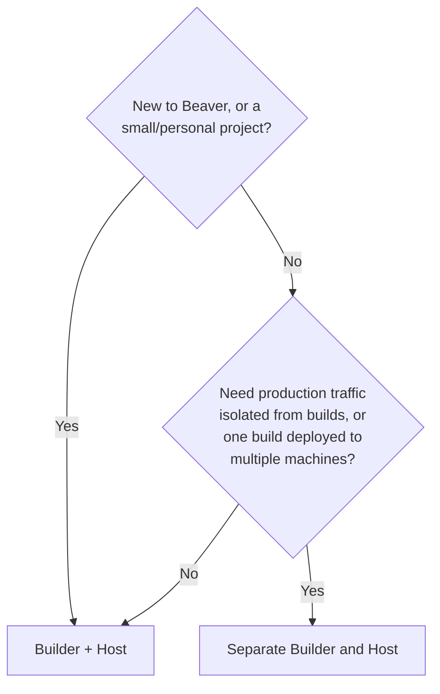
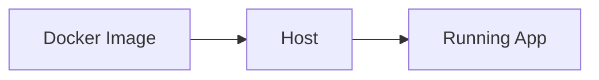

# Machine Roles

Beaver connects to infrastructure you already own — a VPS, a cloud instance, a bare-metal box, whatever you've got — and deploys your application to it.

When you connect a machine with [`beaver connect`](/connect), you choose a **role** for it. The role tells Beaver what that machine is for: building your application, running it, or both.

<Info>
  Just want a quick answer? [Choose Your Beaver Setup](/choose-your-setup) covers the same decision in under 2 minutes. This page goes deeper into requirements and when to split roles.
</Info>

<CardGroup cols={3}>
  <Card title="Builder" icon="hammer">
    Turns your code into a Docker image.
  </Card>
  <Card title="Host" icon="server">
    Runs your application.
  </Card>
  <Card title="Builder + Host" icon="layer-group">
    Does both, on one machine.
  </Card>
</CardGroup>

<Info>
  You're not locked into your choice. Change a machine's role anytime with [`server update --role`](/cli#server-update-machine-id).
</Info>

---

## Choosing Your Setup

If you're not sure which role to pick, this is the short answer:

<Tip>
  Starting out, or working on a smaller project? Choose **Builder + Host**. It's one machine, it's simple, and you can always split roles later without changing anything about your Dockerfile or your app.
</Tip>

Split into a dedicated Builder and Host once you need your build process and your running application kept on separate machines — for example, to keep production traffic isolated from build activity, or to deploy the same build to more than one Host.

| Your situation | Recommended setup |
| --- | --- |
| Personal project | Builder + Host |
| Learning Beaver | Builder + Host |
| Small team | Builder + Host (one per environment, e.g. staging and production) |
| Production workloads | Dedicated Host, with a separate Builder |
| Large-scale deployment | Dedicated Builder(s) feeding multiple Hosts |

---

## Builder

A Builder is a machine that turns your code into a Docker image, ready to deploy. It doesn't run your application or serve traffic — its job ends once the image is ready.

### When to choose Builder

Pick a dedicated Builder when you want build activity kept off the machine running your live application — for example:

- Your project has a heavy build process (large dependencies, compiled languages) and you don't want it competing with your app for resources
- You deploy often and want builds happening independently of your running app
- You're producing one image that gets deployed to more than one Host

If none of that applies yet, [Builder + Host](#builder-host) is simpler and works just as well.

### Requirements

<Columns>
  <Column>
    <Check>A supported Linux distribution (Ubuntu, Debian, or Rocky Linux)</Check>
    <Check>Docker Engine installed and running</Check>
    <Check>Git installed</Check>
    <Check>Internet connectivity</Check>
  </Column>
  <Column>
    <Info>
      **Recommended minimum:** 2 vCPUs, 4 GB RAM, 20 GB disk. Increase this if your build process is dependency-heavy.
    </Info>
  </Column>
</Columns>

---

## Host

A Host is a machine that runs your application and keeps it reachable. It doesn't build anything — it takes a ready-made Docker image and runs it.

### When to choose Host

Pick a dedicated Host when you want your running application kept separate from your build process — for example:

- You want production traffic served by a machine that never runs a build
- You're scaling out and want the same application running on more than one machine
- You already have (or plan to add) a Builder elsewhere producing the image this machine will run

### Requirements

<Columns>
  <Column>
    <Check>A supported Linux distribution (Ubuntu, Debian, or Rocky Linux)</Check>
    <Check>Docker Engine installed and running</Check>
    <Check>Internet connectivity</Check>
    <Check>Reachable on the port your app serves traffic on</Check>
  </Column>
  <Column>
    <Info>
      **Recommended sizing:** match your machine to your application's own needs, plus a small margin for headroom.
    </Info>
  </Column>
</Columns>

---

## Builder + Host

Builder + Host is a single machine that both builds your application and runs it. It's the simplest setup Beaver offers.

### Why beginners and small projects should choose this

<Check>One machine to connect — nothing to plan out before you deploy.</Check>
<Check>No idle capacity — a separate Builder sits unused between deploys, which isn't worth it on a small project.</Check>
<Check>Nothing to keep in sync between two machines.</Check>

`beaver connect` recommends Builder + Host by default when a single machine qualifies for both roles. Move to a split Builder and Host only once your project actually needs it — see [Choosing Your Setup](#choosing-your-setup).

---

<CardGroup cols={2}>
  <Card title="CLI Reference" icon="terminal" href="/cli#connect">
    See the `connect` and `server update --role` commands used to assign and change roles.
  </Card>
  <Card title="Quickstart" icon="rocket" href="/quickstart">
    Connect your first machine and deploy an app end to end.
  </Card>
</CardGroup>
