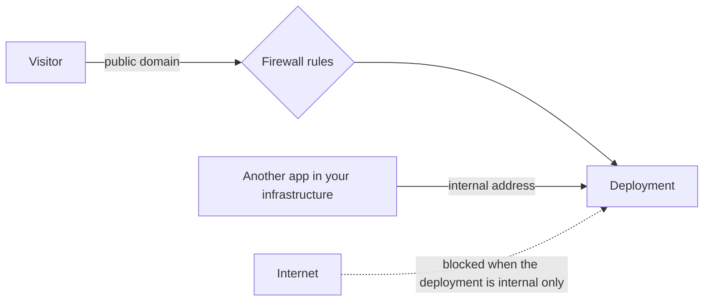

A **domain** points at a deployment, making it reachable at a URL instead of only an
internal address. Attach one and Beaver issues and renews the certificate for you.

In the CLI: `beaver domain add --container paperclip-web --domain paperclip.example`; `beaver domain verify dom_abc123`.

## The path from "added" to "live"

Adding a domain doesn't make it live by itself — you still need to point DNS at Beaver, wait
for it to propagate, then verify. Once verification passes, certificate issuance happens
automatically. Most "why isn't my domain working" questions come down to which of these
steps hasn't happened yet: check `beaver domain verify` first, then `beaver domain
certificate` for issuance status.

## What you can see and control

Adding a domain is: point its DNS at the address Beaver gives you, then attach it to a
deployment. The certificate is issued and kept renewed automatically once DNS is verified —
you never request or renew it yourself. You also choose whether a deployment is publicly
reachable at all, or only reachable internally within your infrastructure.

## Diagnosing unreachable

Check verification and certificate status first, per the steps above. If both are clean but
the domain is still unreachable, the next place to check is [Firewall](/network/firewall) —
a rule may be blocking the traffic you expect through.

## Where to go next

<CardGroup cols={2}>
  <Card title="Deployments" href="/deploy/deployment-lifecycle">
    What a domain attaches to.
  </Card>
  <Card title="Firewall" href="/network/firewall">
    Traffic reaching a domain passes through firewall rules, if any are set.
  </Card>
  <Card title="Domain command reference" href="/cli/domain">
    Exact syntax and status states.
  </Card>
  <Card title="Troubleshooting" href="/operate/troubleshooting">
    The full unreachable-application symptom list.
  </Card>
</CardGroup>
